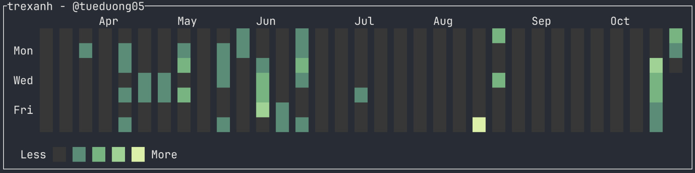

# trexanh

> trexanh is a GitHub contribution graph TUI, written in 🦀 Rust :))



## How to use

### 1. Download the binary
### 2. Make it executable
- Run `chmod +x trexanh`
### 3. Get a GitHub fine-grained access token with the Public Repositories permission
### 4. Run
```bash
./trexanh
```
and input your GitHub username and token

## Roadmap

- [ ] Add async cache with background fetch (fork) to display cached data instantly and refresh in the background (cached mode)
- [ ] Add watch mode to refresh graph at intervals
- [ ] Add TUI for username and token input
